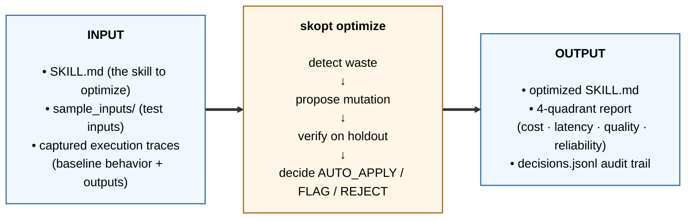
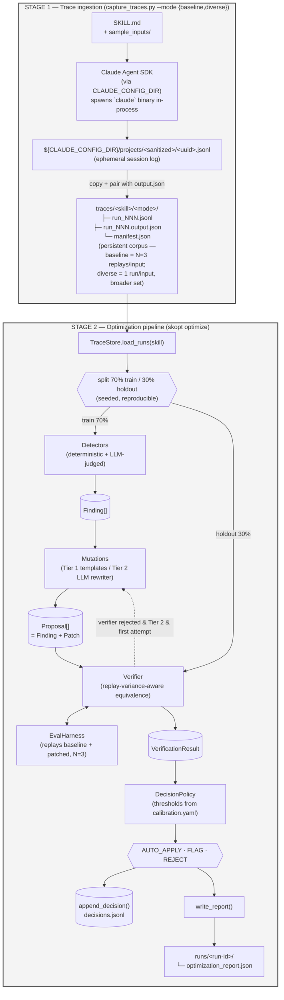
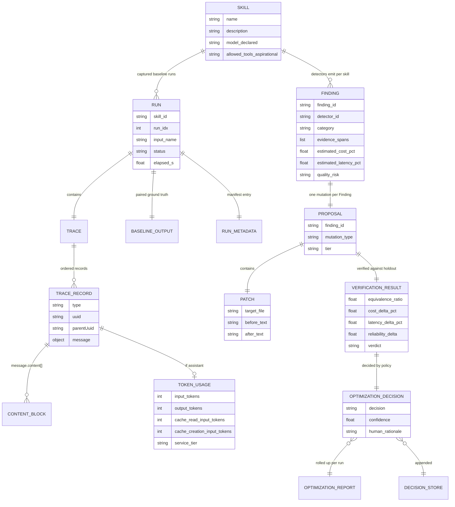
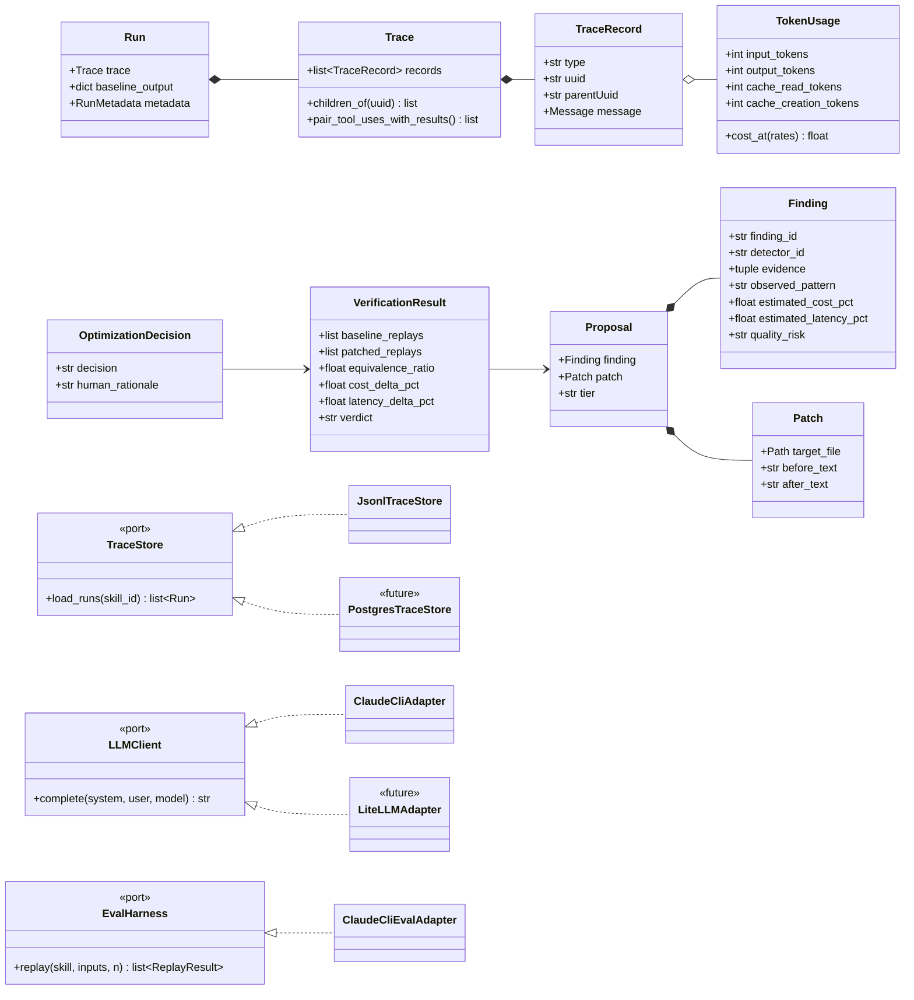
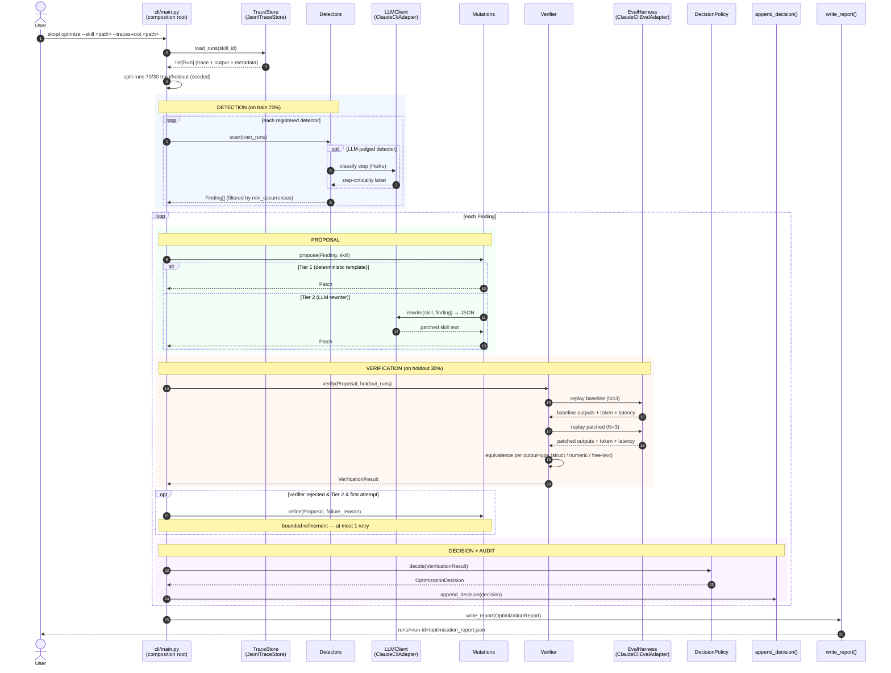

# Architecture

## At a glance



The optimizer reads a skill and its execution history, finds where the skill spends more than it needs to (cost / latency / quality / reliability), and rewrites it — verifying against a held-out replay split such that no dimension regresses.

---

The system has two stages: 

**Stage 1 — trace ingestion** records runs of a skill into a stable, repo-relative corpus with two parallel shapes (`baseline/` for N=3 replays per input; `diverse/` for one-run-per-input across a broader input set — rationale in **DESIGN-DECISIONS.md → Trace corpus shape**). 

**Stage 2 — optimization** reads that corpus, detects waste patterns, proposes mutations, verifies them on a held-out replay split (drawn from `baseline/`), decides AUTO_APPLY / FLAG / REJECT, audits, and reports.

**Runtime path:** Capture (Stage 1) and replay (Stage 2 verifier) drive Claude Code via the **Claude Agent SDK** (`claude_agent_sdk.query`). The Tier-2 LLM rewriter calls go through `ClaudeCliAdapter`, which shells out to the `claude` CLI binary as a subprocess.

**Scope.** This project targets single-purpose Claude Code skills with a bounded tool surface — one skill at a time, batch optimization against a captured corpus. Eight demo skills under `demo/skills/` cover the target platform's named catalog shapes plus adjacent structured-output cases. Deliberate omissions: multi-skill orchestration, cross-skill mutation propagation, online/real-time optimization, and paired statistical significance testing.

> Methodology, hypotheses, measurement, scope rationale, and active detector roster: **[APPROACH.md](./APPROACH.md)**.
> Rationale for each design choice and rejected alternatives: **[DESIGN-DECISIONS.md](./DESIGN-DECISIONS.md)**.

---

## 1. System overview



The dashed back-arrow from verifier to mutation is **bounded refinement**: Tier-2 mutations get exactly one retry, then REJECT.

---

## 2. Core invariants

These are the rules that define the system's safety posture. Every other design choice is downstream of them.

1. **The verifier is the gate.** A mutation reaches AUTO_APPLY only when the patched skill passes structural equivalence on the holdout split, on every dimension it claims to improve. LLM-as-judge contributes a free-text similarity score; it never decides verdict alone.

2. **Train on 70%, verify on 30% — both seeded.** Detection runs on the train split; verification replays both baseline and patched skill on the holdout split. The verifier never sees the traces the detector was tuned against.

3. **Replay variance is input, not noise.** Each verification fires N=3 replays of baseline AND patched against each holdout input. Equivalence is mean-of-means with replay-variance bands; aggregate-pass that hides per-replay regression is REJECT.

4. **Bounded refinement, not exploration.** Tier-2 rewriter gets exactly one retry when the verifier rejects. After that, REJECT. There is no agent loop, no candidate population, no self-evaluating supervisor.

5. **Four dimensions, never collapsed.** Cost, latency, quality, and reliability are reported as separate quadrants. A patch that improves cost but regresses quality is REJECT — there is no composite "improvement score" to game.

6. **Single-trace evidence is noise.** A pattern must recur across `min_occurrences` traces (default 3) before any detector emits a Finding. One-off observations do not produce Proposals.

---

## 3. Data model (ERD)

> **Reading note:** Logical data model. Some entities are conceptual and live as filesystem artifacts in the implementation, not classes — `SKILL` is a directory, `BASELINE_OUTPUT` is the paired `output.json`, `RUN_METADATA` is a manifest entry, `DECISION_STORE` is an append-only JSONL file.



**The load-bearing relationship is `RUN ⇒ BASELINE_OUTPUT`.** Without the paired `output.json`, the verifier has nothing to compare patched replays against. This is why the capture script writes them as a pair, and why `manifest.json` is the entry point (not the bare JSONL).

### 3.1 Concrete record shapes

These are illustrative shapes — exact fields will stabilize as detectors and the verifier are implemented. They show what the abstractions in the ERD look like as actual JSON.

A **Finding** emitted by D004 (model-tier downgrade) on the `ticket_router` skill:

```json
{
  "finding_id": "skopt-2026-05-08-d004-ticket_router-001",
  "detector_id": "D004",
  "skill_id": "ticket_router",
  "category": "model_tier_overkill",
  "observed_pattern": "All 30 traces use claude-sonnet-4-6 for keyword-driven routing classification. No reasoning depth observed beyond category lookup.",
  "evidence_spans": [
    {"trace": "run_001.jsonl", "record_uuid": "9ac2-...", "fragment": "model: claude-sonnet-4-6; output: routing decision in <300 tokens"},
    {"trace": "run_007.jsonl", "record_uuid": "018d-...", "fragment": "..."}
  ],
  "step_criticality_label": "downgrade",
  "estimated_savings": {"cost_pct": -78, "latency_pct": -40},
  "quality_risk": "low",
  "min_occurrences_met": true,
  "occurrences": 30
}
```

A **Proposal** = `Finding` + `Patch` (Tier-1 deterministic template):

```json
{
  "proposal_id": "skopt-2026-05-08-d004-ticket_router-001-prop",
  "finding_id": "skopt-2026-05-08-d004-ticket_router-001",
  "tier": "1",
  "mutation_type": "model_swap",
  "patch": {
    "target_file": "demo/skills/ticket_router/SKILL.md",
    "before_text": "model: claude-sonnet-4-6",
    "after_text": "model: claude-haiku-4-5"
  },
  "expected_effect": {"cost_delta_pct": -78, "latency_delta_pct": -40, "quality_delta": 0}
}
```

An **OptimizationDecision** appended to `decisions.jsonl`:

```json
{
  "decision_id": "skopt-2026-05-08-d004-ticket_router-001-decision",
  "proposal_id": "skopt-2026-05-08-d004-ticket_router-001-prop",
  "decision": "AUTO_APPLY",
  "confidence": 0.94,
  "verification_result": {
    "holdout_inputs": 3,
    "replays_per_input": 3,
    "equivalence_ratio": 1.0,
    "cost_delta_pct": -78.4,
    "latency_delta_pct": -42.1,
    "quality_delta": 0.0,
    "reliability_delta": 0.0,
    "verdict": "PASS"
  },
  "human_rationale": "Holdout replay (3 inputs × 3 replays = 9 baseline + 9 patched) shows perfect structural equivalence on routing primary fields (team, priority, category). Cost reduced 78% with no observed quality regression. Pure frontmatter model swap, no prompt change — risk profile is low.",
  "applied_at": "2026-05-08T14:23:11Z"
}
```

A **FLAG `OptimizationDecision`** — the in-between verdict between AUTO_APPLY and REJECT (illustrative scenario the verifier is designed to surface; rationale in **[DESIGN-DECISIONS.md](./DESIGN-DECISIONS.md)**):

```json
{
  "decision_id": "skopt-2026-05-03-d004-ticket_router-001-decision",
  "proposal_id": "skopt-2026-05-03-d004-ticket_router-001-prop",
  "decision": "FLAG",
  "confidence": 0.78,
  "verification_result": {
    "holdout_inputs": 9,
    "replays_per_input": 1,
    "equivalence_ratio": 0.89,
    "cost_delta_pct": -78.0,
    "latency_delta_pct": -5.8,
    "quality_delta": -0.11,
    "reliability_delta": 0.0,
    "verdict": "PARTIAL"
  },
  "human_rationale": "8 of 9 holdout tickets matched baseline on (team, priority, category). The single mismatch (ticket_008.txt) was a cross-team data-export request: baseline routed to `legal`, patched routed to `support`. Both outputs set requires_human_review=true, so a human will adjudicate the routing in either world. Recommended for human review before AUTO_APPLY.",
  "flagged_for_review": true
}
```

FLAG is what catches mutations that are *almost certainly safe* but disagree with the baseline on inputs where humans review anyway. Without FLAG, the verifier would either ship a partial regression (if the gate is loose) or reject a defensible mutation (if the gate is strict). The above example — a near-pass equivalence with the only disagreement being a cross-team judgment call already flagged for human review — is the kind of edge case the verifier's three-verdict policy is designed to surface rather than collapse.

---

## 4. Code structure (class diagram)

> **Reading note:** Target architecture. Port abstractions (`TraceStore`, `LLMClient`, `EvalHarness`) and their concrete adapters are implemented. `<<future>>` classes are extension points — concrete adapters that haven't been built but slot into the same ports (`LiteLLMAdapter` for routing through an org's LiteLLM proxy; `PostgresTraceStore` for persistent trace corpora). Decision-store and report-writer responsibilities live as concrete functions (`append_decision`, `write_report`) in `domain/`, not yet abstracted into ports.



`<<port>>` boxes live in `ports/` — pure ABCs (`TraceStore`, `LLMClient`, `EvalHarness`). Concrete adapters in `adapters/`: `JsonlTraceStore` reads JSONL from disk; `ClaudeCliAdapter` and `ClaudeCliEvalAdapter` shell out to the `claude` CLI subprocess via the Claude Agent SDK. `<<future>>` classes are extension points that slot into the same ports — `LiteLLMAdapter` for routing through an org's LiteLLM proxy, `PostgresTraceStore` for persistent trace corpora. Decision-store and report-writer responsibilities are concrete functions (`append_decision`, `write_report`) in `domain/`, not yet abstracted into ports. Domain entities (no stereotype, top group) live in `domain/` — stdlib `@dataclass(frozen=True)` only, never import adapters.

---

## 5. Runtime sequence (one `skopt optimize` call)



Each colored band is a pipeline phase. The composition root (`cli/main.py`) is the only place adapters are imported; everything else flows through the port abstractions.

---

## 6. Layers and dependency rules

| Layer | Contents | Import rule |
|---|---|---|
| `domain/` | Trace, Run, Finding, Proposal, VerificationResult, OptimizationDecision, detectors, mutations, decision policy, report writer | stdlib `@dataclass(frozen=True)` only; **never** imports `adapters/` |
| `ports/` | abstract interfaces (`TraceStore`, `LLMClient`, `EvalHarness`) | ABCs only |
| `adapters/` | concrete I/O — Claude CLI subprocess invocation, JSONL filesystem | the only modules that import the SDK or hit disk |
| `cli/` | composition root + the `skopt optimize` entrypoint | the only place adapters are imported |

## 7. Implementation rules

Beyond the Core Invariants in Section 2, these are the runtime/structure rules that shape day-to-day code:

- **Configurable corpus root.** `--traces-root <path>` repoints the optimizer at any captured corpus following the `<skill>/<mode>/` layout — no code change to ingest a corpus produced elsewhere. The verifier always uses a held-out split of `baseline/`. (Per-detector corpus requirements live in **APPROACH.md**.)
- **Verifier replays through the same SDK path as the capture script.** Replay equivalence is meaningful only when the runtime surface matches; runtime hygiene lives in one place — `src/skill_optimizer/runtime.py` — and is reused in both stages.
- **Equivalence is semantically aware, not field-blind.** The verifier's primary-field set is conditional on the output's escalation status: a disagreement on `team` is a regression when `requires_human_review = false` (the autonomous decision changed) but acceptable when `true` (a human adjudicates regardless). Rationale in **[DESIGN-DECISIONS.md](./DESIGN-DECISIONS.md)**.

## 8. Trace data model (real shapes from captured corpus)

| Record type | Role |
|---|---|
| `queue-operation` | enqueue/dequeue marker for the user prompt |
| `user` | user-side messages and tool results (`message.content` array, plus top-level `toolUseResult` field on tool-result records) |
| `assistant` | model output — `message.content` array of `text` / `thinking` / `tool_use` blocks; `message.usage` carries token counts; `message.model` carries model id |
| `attachment` | sidecar payloads (e.g., `deferred_tools_delta`) attached to a turn |
| `ai-title` | model-generated session title (cosmetic; ignored by detectors) |
| `last-prompt` | end-of-session marker referencing the leaf record uuid |

Content-block types inside `message.content`: `text`, `thinking`, `tool_use`, `tool_result`. Tool-use/tool-result pairing flows through `tool_use_id`.

Token usage per assistant record: `input_tokens`, `output_tokens`, `cache_read_input_tokens`, `cache_creation_input_tokens`. The trace parser preserves the raw `usage` dict; cost math reads only these four buckets. Cost weighting uses per-bucket pricing — see Section 9 for the formula and Anthropic's per-bucket rates.

## 9. Cost accounting

Two layers — **estimate** and **measured** — both summing real `message.usage` tokens × per-model rates from [`../config/pricing.yaml`](../config/pricing.yaml). Same formula, different token sources.

### The formula

```
cost = (input_tokens   × input_rate
      + output_tokens  × output_rate
      + cache_read     × cache_read_rate
      + cache_create   × cache_create_rate) / 1_000_000
```

`TokenUsage.cost_at` at `src/skill_optimizer/domain/token_usage.py:46` — the only cost formula in the system.

### Inputs

**Tokens** come straight from Anthropic — every assistant message in the JSONL trace carries a `usage` dict with the four counters. The system reads them; it doesn't tokenize or re-estimate.

**Rates** are transcribed from Anthropic's public list price into `config/pricing.yaml` — dated (`as_of: "2026-05-06"`), one-file update on rate changes.

| Model | input | output | cache_read | cache_create |
|---|---:|---:|---:|---:|
| `claude-haiku-4-5` | $0.80 | $4.00 | $0.08 | $1.00 |
| `claude-sonnet-4-6` | $3.00 | $15.00 | $0.30 | $3.75 |
| `claude-opus-4-7` | $15.00 | $75.00 | $1.50 | $18.75 |

*USD per Mtok.*

### Why four buckets, not one

Anthropic charges four different rates per turn:

- `output` ≈ 5× the `input` rate
- `cache_read` = **10% of the input rate** — the major savings lever
- `cache_create` = **125% of the input rate** — premium to write to cache

Cache-heavy Claude Code traces (system prompt + SKILL.md sit in cache across turns) would be wildly overstated if `cache_read` were collapsed into `input`.

### Per-message model resolution

`trace_cost` reads `message.model` on each assistant message individually (`token_usage.py:65`). The SDK can route specific turns to a different tier than the SKILL.md declared, and captured traces reflect that. Costing per-message means the result is what actually ran, not what was declared. Unknown model → raises, never silently zeros.

### Estimate vs. measured

| Layer | Field | Tokens summed | When |
|---|---|---|---|
| **Estimate** | `Finding.estimated_cost_pct` | Baseline-trace tokens, with the detector's guess of what the mutation eliminates | Detection time |
| **Measured** | `VerificationResult.cost_delta_pct` | Fresh patched-replay tokens, vs. the same input's baseline | After N=3 holdout replays |

**The gate uses the measured value** (`decision_policy.py:33`). The estimate survives for ranking and detector calibration.

How each detector estimates differs:

- **D004 (model swap)** re-prices the baseline trace at the target model's rates (`cost_at_model` at `token_usage.py:82`). Tokens unchanged; only the rate column flips. High-confidence — the only unknown is whether the runtime honors the swap.
- **D001, D003, D006, D008, D012** each simulate their specific mutation against the baseline — e.g., D001 counts the tokens of the duplicated `Read` and calls that the savings. Heuristic, not prediction.

`measure_cost_delta` (`verifier.py:217`) does the measured math: per replay, `(patched_cost − baseline_cost) / baseline_cost × 100`, then mean ± stddev across all successful replays. Falls back to the estimate only if zero replays produced a usable trace.

### Methodology notes

1. **Always post-hoc reprice.** Both layers cost from JSONL tokens × YAML rates. There is no live pricing API. The same trace can be re-costed by updating `pricing.yaml` — useful for rate-sensitivity sanity checks.
2. **Estimate and measured can diverge — that's the point.** Estimates predict the LLM will follow the rewritten SKILL.md; measurement catches whether it actually did. A detector estimating −70% but verifying at −20% is the detector being optimistic about LLM compliance, not a bug.
3. **Per-trace mean, not aggregate.** Each trace contributes one ratio; traces with different cache-vs-direct-input mixes contribute proportionally rather than being dominated by the longest trace (`d004_model_tier.py:96`).

See [`APPROACH.md`](./APPROACH.md) Section 4 *What gets measured* + Section 6 *Calibration*.

## 10. SKILL.md frontmatter contract

| Field | Status (current corpus) | Used by |
|---|---|---|
| `name`, `description` | required (declared in all 8 demo skills) | discovery |
| `model` | declared in 7 of 8 demo skills (only `ticket_router` omits it); defaulted otherwise | D004 (model-tier downgrade) — undeclared skills get a configured default |
| `primary_fields` | optional; falls back to three-tier auto-derivation (see [DESIGN-DECISIONS.md ADR-002](./DESIGN-DECISIONS.md)) | verifier equivalence check |
| `output_path` | optional; defaults to `"output.json"` | trace store + verifier (locates the skill's structured answer) |
| `input_glob` | optional; defaults to `"*"` (every entry in `sample_inputs/`) | input selection |
| `allowed_tools` | not read from frontmatter today; the harness passes a fixed allowlist (`Read`, `Edit`, `Write`, `Bash`). Per-skill enforcement via frontmatter is documented future work. | sandboxing (future) |

## 11. Captured artifacts and run layout

**Trace ingestion writes** (per skill, per `python scripts/capture_traces.py --skill <name> --mode {baseline,diverse}` invocation):

```
traces/<skill>/
├── baseline/                # --mode baseline (default): N=3 replays per input
│   ├── run_NNN.jsonl        # full Claude Code session JSONL (verbatim copy)
│   ├── run_NNN.output.json  # ground-truth output the skill produced
│   └── manifest.json        # {skill, mode, runs[{run, input, status, elapsed_s, trace, output, ...}]}
└── diverse/                 # --mode diverse: 1 run per input, broader input set
    ├── run_NNN.jsonl
    ├── run_NNN.output.json
    └── manifest.json
```

`baseline/` provides the same-input replays D005 (Determinism) uses to classify output fields by stability, and the verifier's held-out split for comparing patched replays against. `diverse/` provides cross-input variation for waste-pattern detectors that benefit from broader input coverage (D003 tool failures, D006 env-setup repeat, D012 helper-script reuse). Either subdirectory may be missing without crashing the pipeline; detectors that require a missing shape return empty.

**Optimization writes** (per `skopt optimize` invocation):

```
runs/<run-id>/
├── decisions.jsonl                  # OptimizationDecision audit trail (append-only)
└── optimization_report.json         # canonical machine-readable artifact
```

## 12. Sandboxing

- Each capture/replay runs in the skill's `cwd`; skills cannot persist state across replays beyond `output.json` (which the harness explicitly cleans between runs).
- Process env strips `ANTHROPIC_API_KEY` (in `runtime.setup_aklaude_env()`) so the SDK-spawned `claude` binary's auth always flows through `CLAUDE_CONFIG_DIR`.
- Tool whitelist is currently set at the harness level — the verifier passes `("Read", "Edit", "Write", "Bash")`; the capture-replay runtime adds `Task` for sub-agent dispatch. Per-skill enforcement via frontmatter is future work, not a current guarantee.

## 13. Testing layout

- `tests/unit/domain/` — detectors, mutations, decision policy against fixture traces; no I/O
- `tests/unit/adapters/` — adapters against fakes and mocked SDK message streams; uses small captured fixture runs under `tests/fixtures/`
- `tests/integration/` — full pipeline against real captured traces from `traces/<skill>/baseline/`
